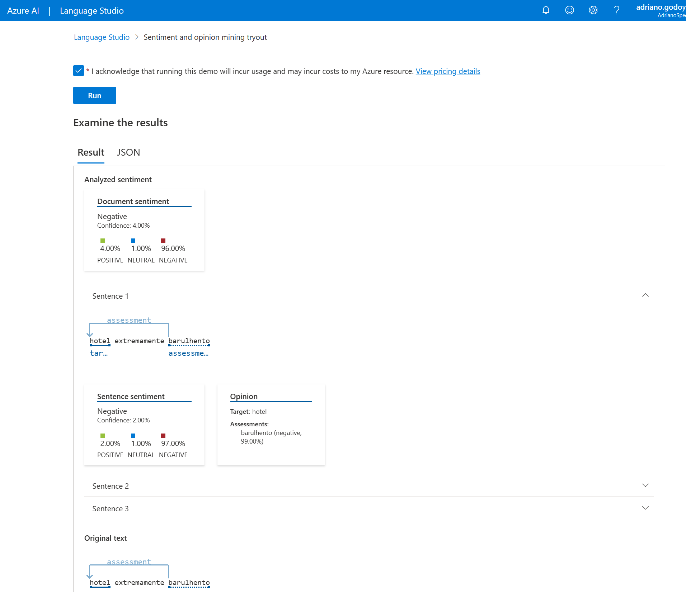
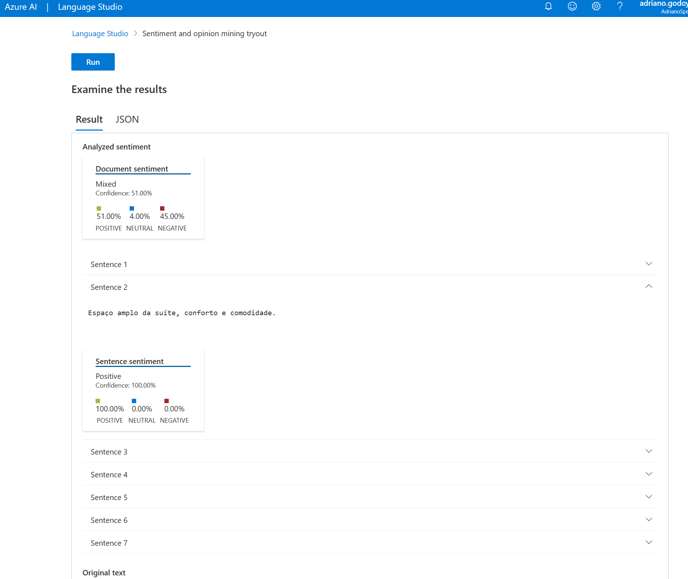
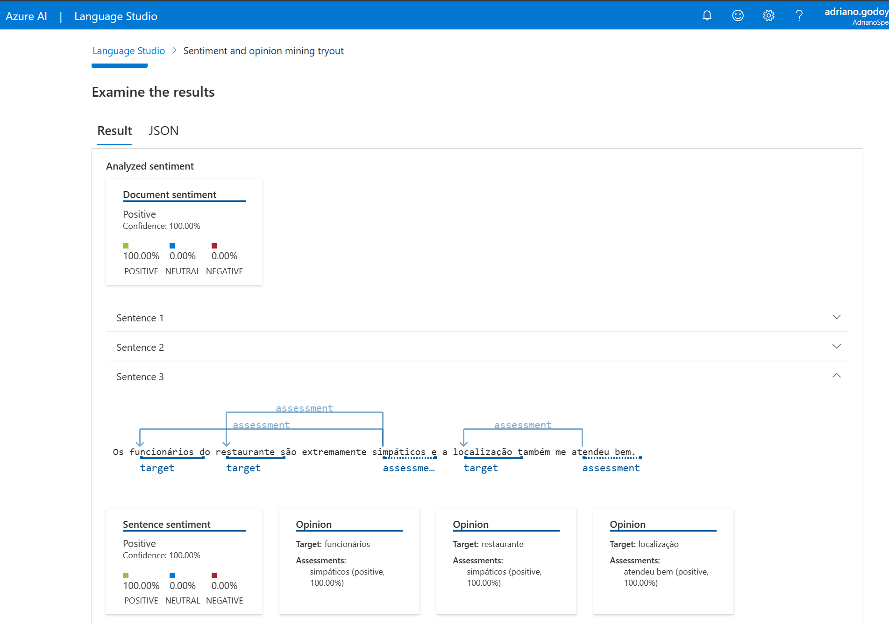

# Análise de Textos com Language Studio
Para utilizar Azure Language Studio é necessário antes criar um recurso do tipo Language e acessa o Language Studio através do Link: https://language.cognitive.azure.com/home. Na aba *Classify text* escolha a opção *Analyze sentiment and opinions*.

## Sentença 01

"hotel extremamente barulhento

Não curtiu · a rua atrás do hotel tem diversos bares que disputam para ver quem faz mais barulho e isso não foi suficiente para que o impar suítes hotel colocasse janelas antirruídos."

### Resultado

## Sentença 02

"Excepcional
 
Curtiu · Espaço amplo da suíte, conforto e comodidade.
Acessibilidade.
Café da manhã completo.
Conveniência dentro do hotel.

Não curtiu · Faltou ter mais opções de tomadas e tbm formato de tomada acessível a diversos aparelhos."

### Resultado

## Sentença 03

"Muito bom

Os funcionários do restaurante são extremamente simpáticos e a localização também me atendeu bem.
O chuveiro é maravilhoso."

### Resultado

